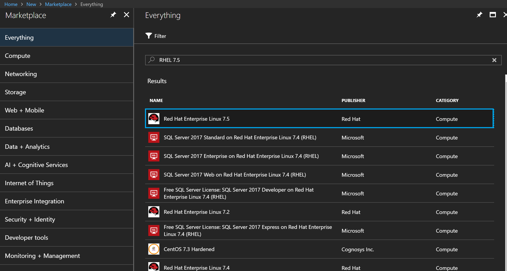
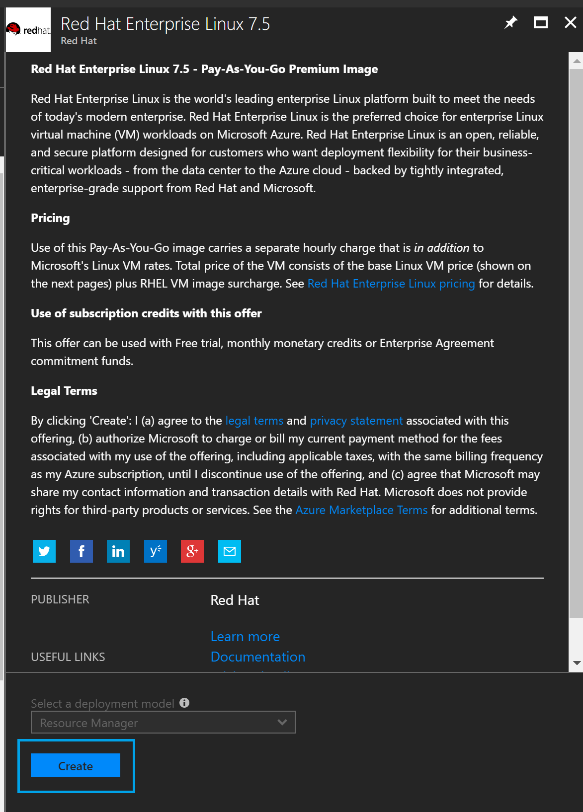
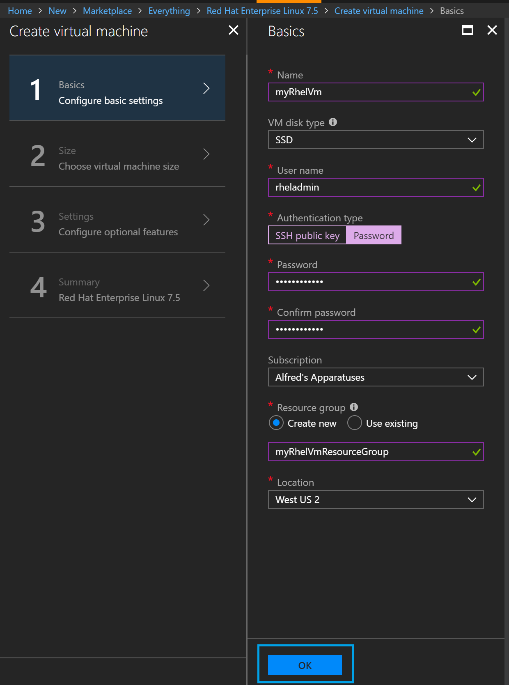
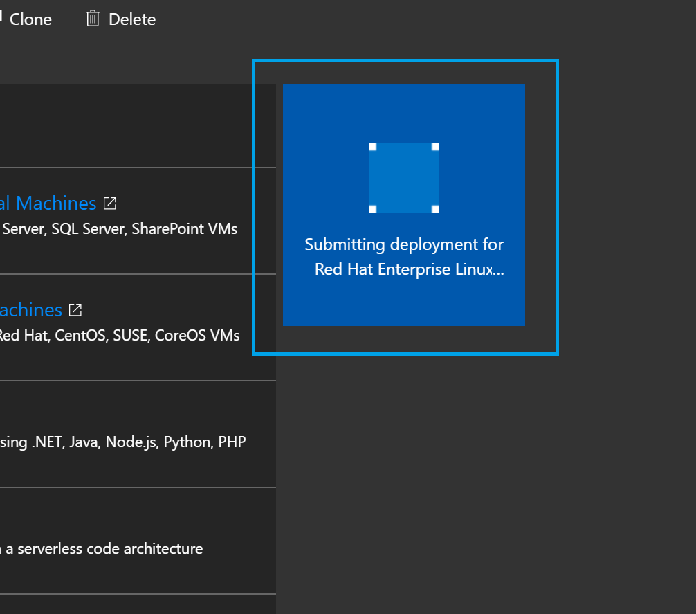

## Part 0: Prework and starting with Microsoft Azure
**Estimated time: 35 minutes**

The prework for this lab will walk you through the Azure sign-up process, as
well as the preliminary steps of setting up Cloud Shell and provisioning your
first RHEL VM in your new subscription. Full completion of this prework is
necessary not only to gain basic experience with Azure, but to ensure that
the time-consuming "first run" processes happen for your Azure account before
the lab and not during the lab. This will allow us to focus lab time on the
intended lab content. Please complete ALL of Section 0 before coming to the lab.

**IMPORTANT NOTE:** You must email <openshiftrunsonazure@microsoft.com> for an Azure Pass
as part of this prework. Send an email with your first and last name to
<openshiftrunsonazure@microsoft.com> requesting that you be provisioned an Azure
Pass and you will receive one within 24 hours. Seriously, stop reading this and
email us RIGHT NOW! We promise to respond as soon as possible, but we sometimes
sleep so we might not respond as quickly to 3am emails. Once you have that pass,
you may complete the rest of the prework.

### 0.1: Signing up for Azure (estimated time: 5 minutes)
You have now presumably received an Azure Pass from us. This pass contains
$250USD of credit for Azure services and is good for 1 month. Any unused credit
at the end of the month will expire and all paid services will be stopped. You
will have the option of converting the Pass to one of the paid options at
the expiration of the Pass, or you can just let it expire. Your choice!

You will need a Microsoft Account to sign up for the Azure Pass. The Microsoft
Account is required to access Azure services.

> NOTE:
> If you have used any Microsoft Services such as OneDrive, Office365, Outlook.com,
> Hotmail.com, XBox, Skype, or Bing Rewards, or have a @outlook.com, @hotmail.com,
> @live.com email address, then you probably have a Microsoft Account. If you
> don't have a Microsoft account, go to (https://account.microsoft.com) and sign
> up for an account there.

Once you have a Microsoft account, you will need to sign up for Azure. To do this,
go to (https://azure.microsoft.com/free), select "Start Free", and follow the
instructions there.

### 0.2: Redeeming an Azure Subscription using your Azure Pass (estimated time: 15 minutes)
The Azure Pass is a special code that gives you an Azure subscription very
similar to the Azure Free Trial. The Azure Pass does NOT require a credit card
to redeem.

Once you have the code, start the Azure Pass redemption process at
(https://www.microsoftazurepass.com/)
and follow the steps there. Further instructions are available at
(https://www.microsoftazurepass.com/Home/HowTo).

### 0.3: Start Cloud Shell for the first time (estimated time: 2 minutes)
In the lab, we will be using the Azure Cloud Shell as our primary means of
deployment. For prework, you will merely open Cloud Shell for the first time.
Doing so will ensure that you have Cloud Shell properly set up in your Azure
Account.

Once you have signed up for Azure and redeemed your Azure Pass, visit
(https://shell.azure.com). When prompted, select
Bash as your shell of choice. Once your Cloud Shell instance has loaded, feel
free to close it as you have completed this step now. Or play around with it if
you so choose :smiley:.

### 0.4: Provision a RHEL VM through the Portal UI (estimated time: 10 minutes)
The final prework step is to provision a RHEL VM using the Azure Portal UI. This
will ensure that everything with your Azure Pass and Azure Account is working
properly before the lab. This should take no longer than a few minutes. Begin by
navigating to (https://portal.azure.com).

1. Click on "Create a resource" in the top left corner of the Portal

    

1. Search for "RHEL 7.4" in the search box
1. Select "Red Hat Enterprise Linux 7.4"

1. In the dropdown, select "Resource Manager" as the deployment model. You will
be taken to the Create virtual machine options

    

1. In the "Configure basic settings" step, enter the following:
    1. Name: Any arbitrary name
    1. User name: Any arbitrary username
    1. Authentication type: Password, and choose a password of your liking
    1. Subscription: Ensure this has selected the subscription you have redeemed
    with your Azure Pass.
    1. Resource group: Choose "Create new", and give it any arbitrary name
    1. Location: West US 2
    1. Click "OK"

    

1. In the "Choose a size" step, choose B1s as your VM size (you are free to
spin up a larger VM size, but please note that this might mean that you don't
have enough remaining credits to do the actual lab). Once you have selected B1s,
click the "Select" button.

    

1. In the "Configure optional features" step, you don't have to change anything.
Read it over if you would like, and click "OK".
1. In the Summary step, you can view a summary of the VM you are about to spin up.
Have a look and ensure you like what you see, then click "Create". Creation will
only take a few minutes (in our testing, it took 3 minutes). You will be
redirected back to the Portal dashboard where a tile will appear to indicate
that deployment has begun.

    

1. Do a happy dance because you just created your first RHEL VM on Azure!

### 0.5: Clean up resources (estimated time: 2 minutes)
Remember when we told you above that your Azure Pass only contains $250USD of
credit? Well we wouldn't want you to use it all up before we even start the lab,
so let's clean up everything we just created so you still have ample credit
during the lab. Azure allows for quick deletion of resources grouped together
through the idea of Resource Groups.

1. From the left side of the Portal, click on "Resource groups"

    

1. Select the Resource Group name that you entered in during your VM creation

    

1. Click on the "Delete resource group" button

    

1. Type in the Resource Group name in the text box to tell Azure you're really
sure about deleting it, then click Delete.

    

1. You're done with the Prework!

__*Stop here now that you're done the Prework. Everything that follows will
be completed during the Red Hat Summit lab itself.*__
---